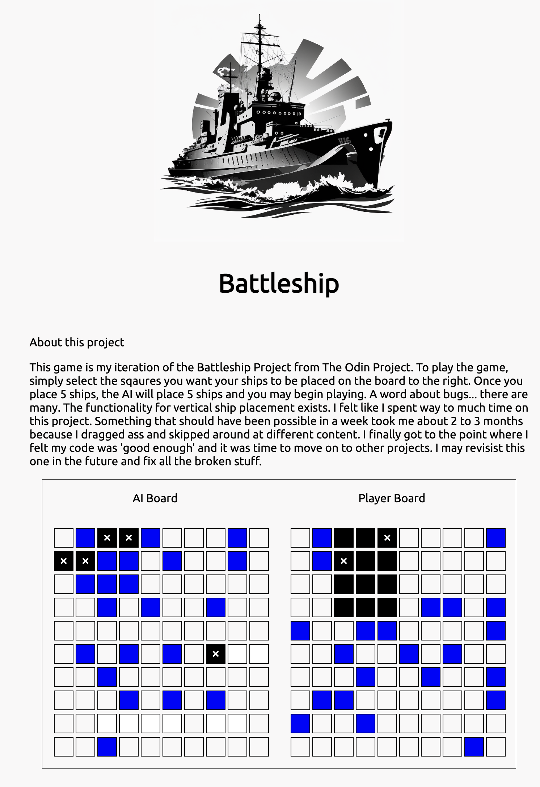

# Battleship

This is the Battleship project for The Odin Project

## Description

A simple battleship game.

## Lessons Learned

Typescript is your friend... seriously. I started this project and figured it would not be a ton of code. Type annotations self document, which makes life easier. Let alone the tooling benefits.
That the code is probably the easier part, the design aspect is harder. Things like which module would contain code to manage function handlers, is that part of the UI module? The game module? neither?
That my code is sloppy and can be improved pretty massively. I started working on the drag and drop features in the 'dragAndDrop' branch. Ultimately though I decided I put too much time in this project. I figured I would come back to it from the ground up eventually.
Use more functional techniques, Im looping way too much.

### Dependencies

Typescript NPM module

### Installing

Just pull repo and run on webserver
